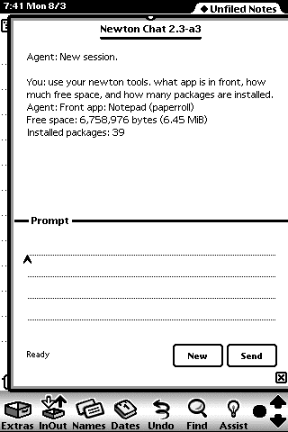
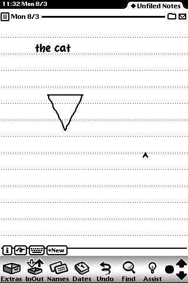
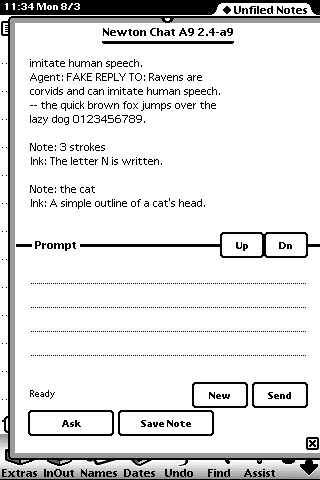
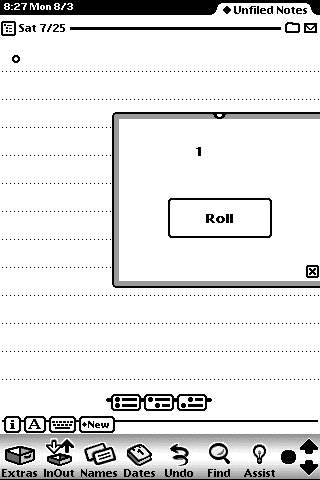

# Egg Freckles

**Modern AI for the Apple Newton MessagePad — Claude Code for a 1997 PDA.**

In 1993 a *Doonesbury* strip put a Newton in Michael Doonesbury's hands, had him
write "I am writing a test sentence," and had the Newton read it back as **"Egg
freckles?"** Apple's engineers took the joke on the chin and buried it in the
ROM: scrawl *egg freckles* in NewtonOS and the machine still answers back. This
project gives that machine the assistant it needed 33 years ago — a frontier
model that reads your ink instead of guessing at it, answers on the Newton's own
screen, and has real tools for managing the device it lives on.

It also writes Newton software. Ask for an app and the agent designs it, builds
a `.pkg` with the period toolchain, installs it into an emulated MessagePad,
taps the buttons, looks at the screen, and iterates.

## What works today

Everything below has run. The screenshots are the Newton's own framebuffer,
320×480, straight out of the emulator.

**Chat with a frontier model, from the Newton.** A native NewtonScript client
talks to a host server over WiFi in a framed ASCII protocol. Proven on the
physical MessagePad 2000 on 2026-08-02 — a full round trip, 19,266 bytes
acknowledged — and continuously in the Einstein emulator since.

**The agent has tools for the device.** Battery, storage, installed packages,
notes, and the front application, exposed to the agent over MCP. The prompt in
this screenshot was typed on the Newton; the numbers in the reply came back off
the Newton:



*"Front app: Notepad (paperroll) / Free space: 6,758,976 bytes (6.45 MiB) /
Installed packages: 39"* — three tool calls inside one turn, 0.13 s, 0.81 s and
0.80 s on the wire. The model is the slow part, not the Newton.

**Draw in Notes, tap Ask.** Newton handwriting recognition was the joke; this
skips it. Sketch on a stock Notes page with its own drawing tools, tap **Ask**,
and the strokes are read out of the soup, encoded, rendered host-side and read
by a vision model whose answer joins the transcript.

| Drawn in stock Notes | Read back into the chat |
|---|---|
|  |  |

**One button, whatever you wrote.** `Ask` sends the newest note as the prompt
*whatever kind it is* — typed text goes down the chat path, splitting across
protocol frames if it is long; a drawing goes to the vision model; a page with
both goes as one request carrying both, which is why the bare triangle above
came back as *"a simple outline of a cat's head."* `Save Note` writes the reply
back as a real NewtonOS note you can find in the Notepad.

**The agent builds Newton apps.** Told to build a dice roller, an agent ran the
whole loop in six tool calls with no intervention and no failed build: compile,
install into an isolated emulator, launch, screenshot, tap the button,
screenshot again.



Every claim above is logged with its evidence in
[`docs/ROADMAP.md`](docs/ROADMAP.md)'s status log, and the raw transcripts and
screenshots live in `runtime/evidence/`.

## How it works

```text
  ┌──────────────────────────┐
  │  MessagePad 2000 / 2100  │   NewtonOS 2.1, native NewtonScript client
  │  or Einstein emulator    │   chat · Ask (text or ink) · Save Note 
  └────────────┬─────────────┘
               │  WiFi (Lucent WaveLAN card) — or emulated NE2000
               │  framed ASCII, 240-byte frames, stop-and-wait, checksummed
  ┌────────────┴─────────────┐
  │  host: server.py :6801   │   stdlib only, one turn in flight
  └────────────┬─────────────┘
               │  spawns a CLI agent as a subprocess
  ┌────────────┴─────────────┐
  │  codex exec  (the agent) │   swap in another CLI agent here
  └────────────┬─────────────┘
               │  MCP over stdio — newton_mcp.py
  ┌────────────┴─────────────────────────────────────────────┐
  │  newton_tool  ──→ POST /tools :18081 ──→ the Newton      │
  │  emulator_*   ──→ Einstein control API (screen/tap/text) │
  │  build_pkg    ──→ tntk toolchain ──→ a real .pkg         │
  │  stage_hw     ──→ staged for the human to install        │
  └──────────────────────────────────────────────────────────┘
```

The constraints are the fun part, and they are 1997's, not ours. Frames are 240
bytes because that is what the client can hold. Everything on the wire is 7-bit
ASCII with CRLF, because the Newton's endpoint layer corrupts a
string-to-binary transition. It is stop-and-wait with an explicit ACK, because
the ROM's `protoBasicEndpoint` does not forgive a second outstanding write. A
prompt longer than 227 characters is split into 220-byte parts and reassembled
on the host. The wire format is pinned by tests and documented in
[`docs/phase3-protocol.md`](docs/phase3-protocol.md).

## Try it

The honest version: this runs on a Linux host, and the emulator path is the one
to start with. You do not need a Newton to see it work — you need a Newton
**ROM**, which is a different problem.

**Before you start you need:**

- A Linux host with rootless [Podman](https://podman.io/) and `podman-compose`.
  On Arch: `sudo pacman -S --needed podman podman-compose passt fuse-overlayfs`.
  That is the only step that wants root.
- **A Newton ROM you dumped from your own MessagePad**, at `secrets/717006`,
  exactly 8,388,608 bytes. It is not distributed here and never will be — see
  the [Einstein emulator's documentation](https://github.com/pguyot/Einstein)
  for how to dump your own.
- The `Newton 2.1` NTK platform file at `secrets/Newton 2.1`, if you want to
  compile packages. Same rule: yours, from your own toolkit.
- An OpenAI account for the `codex` CLI, which is the agent backend today. The
  server spawns it as a plain subprocess (`server.py`, `codex exec`), so
  swapping in another CLI agent is a designed-for change rather than a rewrite.
- `python3` (stdlib only for the host code) and `uv` if you want to run tests.

**Then:**

1. `./refs/fetch-refs.sh` — downloads the Newton manuals and Apple's developer
   Q&A notes that the code and docs cite constantly, and checks them against
   `refs/SHA256SUMS`. Agents working in this repo grep `refs/` all day; without
   this step they are guessing.
2. `./downloads/fetch-downloads.sh` — the Newton Internet Enabler distributions
   and the NIE TCP source used to reverse-engineer the transport. Optional
   unless you are doing networking work.
3. `podman-compose build server` — build the server image.
4. `make server-login` — one-time headless Codex device-auth flow.
5. `make server-mcp` — register the Newton MCP tools with that same Codex home,
   including the approval mode without which non-interactive tool calls fail.
6. `make server-up` — start the chat server on `0.0.0.0:6801`. (`make
   server-test` runs it with a stubbed backend if you just want to prove the
   socket.)
7. `make emulator-up` then `make status` — start headless Einstein. Watch it at
   `http://127.0.0.1:6080/vnc.html?autoconnect=1`.
8. `make newton-packages` — build the client and the loader into
   `runtime/staging/`. (`make toolchain-hello` is the smaller smoke test.)
9. `scripts/install-and-launch.sh /packages/harness-client/egg-freckles.pkg
   'EggFrecklesEF1:jbfly'` — install the client into the running emulator and
   open it. One package carries chat, the device tools, notes and ink; there is
   no separate tools app to install.
10. `make test` — the suite, via `uv run --with pytest pytest -q`.

Full operational detail — ports, the security boundary, the emulator control
API, isolated instances — is in
[`docs/dev-harness.md`](docs/dev-harness.md).

### On real hardware

A physical MessagePad gets packages over WiFi: a loader app on the Newton pulls
a staged `.pkg` from a host listener on port 18081, and the human types the
filename and taps Install. `make stage-hw PKG=examples/<name>` builds and stages
one package and prints the exact short filename to type. The whole story — which
of the three host listeners to use and why, and the bare-metal recovery path
through the NS Basic bootstrap for a device with no installer at all — is in
[`docs/install-paths.md`](docs/install-paths.md). The NS Basic bootstrap is a
lifeline, not the normal path. Installs on real hardware are always
human-confirmed; there is deliberately no agent tool that installs to the
physical device.

## Status and roadmap

This works, and it is young. The physical MessagePad runs `Chat A7` plus the
separate `HarnessToolsR10P` tools client, installed at the 2026-08-03 bench
session, where chat, slash commands and agent tool calls all worked on real
hardware (`docs/ROADMAP.md`, status log). Everything since — the scrolling
transcript, the one-button Ask, and the single **Egg Freckles** package that
now carries chat *and* tools in one app — is proven in the emulator and waiting
on bench time; when it goes on, it is one install that replaces both. Ink has
never been drawn with a real stylus into a completed vision-model round trip:
the one attempt failed on a host PATH problem, and the canvas it used has since
been deleted in favour of drawing in stock Notes.

[`docs/ROADMAP.md`](docs/ROADMAP.md) is the plan and the evidence log;
[`docs/START-HERE.md`](docs/START-HERE.md) is where a contributor or a coding
agent should actually start, because it says which docs are ground truth and
which are stale plans.

If you own a Newton: please try this and open an issue. Different card,
different ROM, different NIE version — all of that is untested outside one
MessagePad 2000, and the failure reports are worth more than the successes.

## Credits

This project is a thin layer on top of other people's long, patient work.

- **[Einstein](https://github.com/pguyot/Einstein)** — Paul Guyot's NewtonOS
  emulator. Nothing here would be testable without it.
- **[tntk](https://github.com/ekoeppen/tntk)**,
  **[cDCL](https://github.com/ekoeppen/cDCL)** and
  **[NEWT/0](https://github.com/ekoeppen/NEWT0)** — Eckhart Köppen's toolchain,
  which is how a NewtonScript source file becomes a `.pkg` on Linux in 2026.
- **[UNNA](http://www.unna.org/)** — the United Network of New Tonians
  Archive, which still serves the manuals, the NIE distributions and the driver
  sources this project is built on. The fetch scripts point there.
- **Hiroshi Noguchi's WaveLAN driver** — the reason a MessagePad can join a
  modern-ish WiFi network at all.
- **Paul Guyot's Dock TCP** and the **Newton Research** NCX distributions that
  carry it, preserved here as a recovery layer.
- **The newtontalk community**, whose archived threads answered questions no
  manual does.

## License

MIT — see [`LICENSE`](LICENSE). That covers this repository's own code and
documentation. It does not cover the Apple manuals, ROM, NTK platform file, or
NIE distributions, none of which are redistributed here; the fetch scripts get
them from public archives, and the ROM you dump yourself.
