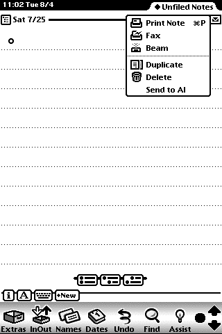
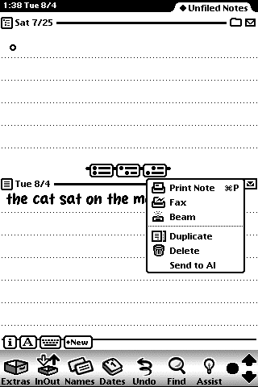

# "Send to AI" in the stock Notes menu — design (Track L2)

**Status: BUILT and emulator-proven — read "Build result" at the end first, it
is the current state.** The design below is kept as written on 2026-08-04
because its reasoning still holds; the build settled every **[verify]** tag in
it and changed four things, all recorded in that final section. Two claims in
the design as written are now known to be wrong in detail: a `RouteScript`
closure cannot be compiled by `tntk` (§1), and uninstall does not depend on
`RemoveScript` at all (§5, §6).

Every mechanism below was measured on isolated emulator instance `l2probe` on
2026-08-04; the transcript with the exact commands and answers is
[`runtime/evidence/l2probe-routescripts.txt`](../runtime/evidence/l2probe-routescripts.txt).
The build's own transcript is
[`runtime/evidence/l2build-round.txt`](../runtime/evidence/l2build-round.txt).

The human asked for this after the second hardware test: *an entry in the Notes
Action (envelope) menu — "Send to AI" — with the reply arriving as a new note,
maybe into a dedicated folder, or a small popup panel*
(`docs/ROADMAP.md`, status log 2026-08-04). It works, and it works better than
the Ask button it will eventually replace.

---

## The one-paragraph answer

Assign an extended array to `GetRoot().paperroll.routeScripts` from the
package's `InstallScript`, and the stock Notes envelope menu grows a "Send to
AI" item. Choosing it calls your function with the **live soup entry of the
note whose envelope was tapped** — so the whole "which note did the user mean?"
problem, the one that sent a D&D note instead of the cat drawing twice, simply
stops existing. Extract the note with the A9 code unchanged, POST it to the
host, and write the answer back as a new note filed into an "AI" folder created
with `AddFolder`. All five links in that chain were run on the ROM.



---

## 1. How a third party gets into another app's Action menu

### What the books offer

The Action picker is assembled at tap time from three sources
(`refs/NewtonProgrammerGuide20.txt:45192-45205`, `:45288-45298`):

1. **transports** whose `dataTypes` accept the target's class — Print, Fax,
   Beam in the screenshot;
2. the **application's own `routeScripts`** array, at the bottom
   (`:46271-46294`);
3. the **current view definition's `routeScripts`**, below those
   (`:46304-46308`).

For a *specific* app there is one documented registry, and it is Names-only:
`RegNamesRouteScript(symbol, routeScriptFrame)` /
`UnRegNamesRouteScript(symbol)`, both platform-file functions called through
`kRegNamesRouteScriptFunc` (`refs/NewtonProgrammerRef20.txt:43732-43746`,
`:43858-43871`). **There is no `RegNotesRouteScript`.** The 2.1 platform file
does contain bare `RegRouteScript` / `UnRegRouteScript` / `extraRouteScripts` /
`devRouteScripts` symbols (evidence §7), but they appear beside the Names
pager/phone entries, both 2.0 books have zero hits for them, and this round did
not probe them. **[verify — optional]** if they turn out to be a general
registry they are strictly nicer than what follows; the design does not need
them.

That leaves two real options:

| Option | What the user sees | Cost |
| --- | --- | --- |
| Register a **transport** (`RegTransport`, `refs/NewtonProgrammerRef20.txt:55428-55445`) | an item in *every* app's Action picker, then a routing slip, then an Out Box item | a whole protoTransport: routing slip, formats, In/Out Box view defs, item lifecycle |
| Append to **`GetRoot().paperroll.routeScripts`** | one item, only in Notes, fires immediately with no slip | one array assignment |

A transport is the sanctioned way to appear *everywhere*; it is the wrong tool
for one app and one verb, and it drags the Out Box into a flow whose whole
point is that the answer comes straight back. Note also that
`GetTransportScripts` (`:53806-53836`) adds items to the **In/Out Box Tag
picker**, not to an app's Action picker — an easy misread, since its array is
"exactly the same as the routeScripts array".

### What we do, and the proof it works

`routeScripts` is looked up "in its own context" from the Action button
(`Guide:46274-46280`), i.e. by normal frame/proto/parent inheritance from the
button up through the Notes base view. The Notes base view frame,
`GetRoot().paperroll`, is a RAM frame whose `routeScripts` comes from a ROM
proto; assigning to it creates an **own slot that shadows the proto**, and
`GetRouteScripts` — the method the picker actually calls
(`refs/NewtonProgrammerRef20.txt:52547-52561`) — returns the shadowing value:

```
len=3 |<GetTitle> |<GetTitle> |Send to AI
```

and the ROM draws it (evidence §3 and the screenshot above). The frame we add
is the documented shape (`Ref:51411-51423`):

```newtonscript
{
    title:       "Send to AI",           // or GetTitle: func(target) …
    icon:        nil,                    // optional bitmap, left of the title
    RouteScript: func(target, targetView) … ,
}
```

`RouteScript` may be a function directly (what we use) or a symbol plus an
`appSymbol` slot naming the app to find it in — the latter only matters for
view definitions (`Ref:51442-51454`). `GetTitle` is the alternative to `title`
and can return `nil` to hide the item, which is how you disable the action when
there is no sensible target (`Guide:46409-46411`).

**Do not use `RemoveSlot` blindly to uninstall.** It restores the ROM array
exactly (evidence §6) — including throwing away any entry a *different*
package added after us. Uninstall by rebuilding the array without our frame,
and only `RemoveSlot` when what remains is identical to the proto's.

---

## 2. What arrives in `target` — and why the newest-note heuristic dies

`target` and `targetView` come from `self:GetTargetInfo('routing)` sent to the
Action button (`Ref:51446-51450`, `Guide:46330-46340`). Measured on the ROM
(evidence §2, §4):

- `IsSoupEntry(target)` is **1**. It is the live Notes soup entry, not a frame
  copy — `EntrySoup(target):GetName()` returns `"Notes"`.
- `TargetIsCursor(target)` is **0** for a single open note.
- Firing from the first note's envelope gave `uid=2`; firing from the second
  note's envelope, with nothing else changed, gave `uid=3`. **The target is the
  page whose envelope you tapped.**

So the A9 extraction runs on it directly: the seventeenth finding established
that `ExpandInk(item, 0)` works on the raw soup frame with no live view
(`docs/newtonscript-eval.md`), and A9's collector walks `entry.data` for
paragraphs and ink. Ask's whole newest-note apparatus — the bounded 16-entry
`EntryModTime` scan, the clock-skew worry in Track L1 — is **not needed on this
path at all**. That is the single biggest reason to build this.

Two guards the probe earned the hard way:

- **`entry.data` can be nil.** Two exceptions (-48410, -48418) came from
  `Length(target.data)` on a blank page. Test `data` before touching it.
- **`ClassOf(item) = 'para` is not a safe test.** A note created by
  `MakeTextNote` holds an item with *no* class slot — `ClassOf` is `'frame`,
  slots `(text, viewBounds, viewFont, _proto, viewStationery)` (evidence §4).
  Typed notes on hardware do carry `'para`, which is why A9's reader works
  today, but the reader must accept "has a `text` slot" as well, or it will
  refuse to re-send a note the harness itself wrote.

If the user is in the Notes **overview** with several notes checked, the target
is a multiple-item object. Do not special-case it: `GetTargetCursor(target,
nil)` "works with any kind of target data, whether or not it's a cursor"
(`Guide:46379-46381`), so send the first entry from the cursor and ignore the
rest in v1. **[verify]** — the overview case was not probed.

---

## 3. Delivering the reply: a note in an "AI" folder

Folders on NewtonOS are just a symbol in the entry's `labels` slot; "Setting
the value of the labels slot is really the only 'filing' that is done"
(`Guide:35418-35427`). The API to create one is documented and measured:

| Call | Ref | Measured |
| --- | --- | --- |
| `AddFolder("AI", 'paperroll)` → `'AI` | `Ref:38952-38966` | returns `AI`; idempotent — "If a folder having the specified name already exists, this function returns that folder's tag without creating a new folder" |
| `GetFolderStr('AI)` → `"AI"` | `Ref:39010-39017` | `AI` |
| `GetFolderList('paperroll, nil)` | `Ref:39046-39055` | `AI,Business,Miscellaneous,personal` |
| `RemoveFolder('AI, 'paperroll)` | `Ref:38990-38999` | not probed **[verify]** — items in it become unfiled, which is the right uninstall behaviour |
| `RemoveAppFolders('paperroll)` | `Ref:39031-39045` | **never call this** — it would delete the user's own Notes folders |

Limits worth knowing: twelve local folders per application, twelve global
folders system-wide, and only the user can create *global* ones
(`Ref:38961-38966`). One local folder for `'paperroll` is what we take.

The write itself is the proven two-step from `docs/notes-bridge.md:210-215`,
then the label:

```newtonscript
local pr   := GetRoot().paperroll;
local tag  := AddFolder("AI", 'paperroll);
pr:NewNote(pr:MakeTextNote(answer, nil), nil, nil);
local last := (GetUnionSoupAlways("Notes")):Query({indexPath: 'timeStamp}):ResetToEnd();
last.labels := tag;
EntryChangeXmit(last, nil);
```

`NewNote` returns nil rather than the entry (measured), so the entry is found
by re-querying and taking `ResetToEnd`, which lands *on* the last entry
(sixteenth finding). End to end this produced:

```
replied uid=6 from=3 chars=46 folder=AI
```

and the note is visible under the "AI" tab:
[`l2probe-folder-picker.png`](../runtime/evidence/l2probe-folder-picker.png),
[`l2probe-ai-folder.png`](../runtime/evidence/l2probe-ai-folder.png).

**Folders do not fight back.** The popup fallback the human offered is not
needed for delivery. A `protoFloatNGo` panel is still worth having as a
*progress* surface — "Thinking…", then "Answer filed in AI" — because a route
script that returns silently and produces a note somewhere else 9 seconds later
is a bad experience. Keep the panel small and optional. **[verify]** — opening
a float from inside a RouteScript was not probed.

One trap: `Length()` on a NewtonScript string returns **bytes**, so the
22-character "the cat sat on the mat" measured 46. Use `StrLen` for characters
(evidence §5). The client already does this correctly at
`examples/harness-client/Main.newt:1261`.

---

## 4. Running without the chat window: the package owns the POST

The route script runs inside the Notes app, in a package we installed. Nothing
about it requires our own app to be open, so **the package must own the network
call itself**. Two candidate transports:

- **the MSGP chat path** — needs the chat connection, the transcript, the
  frame/ACK state machine, and answers into a window the user is not looking
  at. Wrong shape.
- **the `/ink` HTTP POST** — one connection, request carries the note, reply
  comes back on the same connection, no long poll.

Take the second, and reuse it verbatim: A9 already sends a mixed note as *one*
`/ink` POST with the strokes as `S` lines and the page's text as an `H` line
(`docs/ink-client-design.md`, "A9 result"). The wire shape is
`examples/harness-client/Main.newt:1259-1261`:

```
POST /ink HTTP/1.0
Host: 10.42.0.1
Content-Type: application/x-newton-strokes
Content-Length: N
Connection: close

NSI1 <canvasW> <canvasH> <strokeCount>
H <the page's text>
S <nPoints> x0 y0 dx1 dy1 …
```

and the answer arrives as a single `INK <text>\r\n` line
(`Main.newt:1274-1279`). For a text-only note this is `NSI1 w h 0` plus the `H`
line and no `S` lines — the host should then skip the PNG render and answer
from the text alone. **[verify]** — a zero-stroke body has never been sent;
`pkg_publisher.py`'s `/ink` handler needs the branch, and it is a few lines.

No new port, no new protocol, no long poll. The host cost is one `if`.

**Do not block.** The Action picker closes before the script runs (visible in
the probe: the picker was gone and the reply note existed afterwards), but the
route script itself runs on the UI task and NewtonScript is single-threaded — a
synchronous wait would freeze Notes for the ~9 s the vision call takes. Copy
`SendInk`'s structure exactly (`Main.newt:1157-1270`): every `Bind`, `connect`
and `output` is `async: true` with a `CompletionScript`, the reply arrives in
an `InputScript`, and an `AddDelayedCall(…, 150000)` watchdog gives up if the
host never answers. The route script returns `nil` immediately after kicking
the POST off; the reply note is written from the `InputScript`. Returning
`nil` early is fine — the ROM ignores the return value, and the probe's script
did exactly this with no complaint.

**Link ownership is the real hazard.** `Main.newt:463-470` documents one NIE
link with three connections and "whoever shuts down last releases it". If the
route script grabs a link while the chat window holds one, or releases one the
chat still needs, we get the `-16009 invalid call when not connected` failure
the ink round already paid for (`Main.newt:1153-1156`). This is the strongest
argument for the packaging decision below.

---

## 5. Package it as part of Egg Freckles, not as "EF Send"

**Recommendation: fold it into the Egg Freckles client package that Track L1 is
building right now. Do not ship a second package.**

- The human's first complaint of the second hardware test was that two packages
  is annoying; L1 exists to merge the two that already exist. Adding a third on
  the same day undoes that work.
- The route script needs `InetGrabLink`, the endpoint lifecycle, the shared
  `linkID`, and the `serverAddress` — all of which live in the client's part
  frame. A separate package would either duplicate them or fight the client for
  the single link (§4).
- The extraction it needs is A9's, already in that file.

Concretely, the merged part frame at the end of `Main.newt` grows two slots:

```newtonscript
{
    app:      kAppSymbol,
    text:     kAppLabel,
    theForm:  mainView,
    InstallScript: func(partFrame)  … hook Notes …,
    RemoveScript:  func(removeFrame) … unhook Notes …,
}
```

because `InstallScript` "is executed when an application or auto part is
activated on the Newton **or whenever the Newton is reset**"
(`Guide:5209-5210`) — which is exactly what the reboot probe demands: the
injected slot is pure RAM and was gone after `podman restart` (evidence §6).
The matching rule, quoted in the same place (`Guide:5223-5234`): everything
`InstallScript` changes **must** be reversed in `RemoveScript`, or the user
cannot uninstall cleanly.

**[verify]** — no part in this repo has ever used `InstallScript`, and `tntk`'s
handling of those slots is unproven (`grep -rn InstallScript examples/ tools/`
returns nothing). This is the first thing to test, because everything else
hangs off it. Fallback if `tntk` drops them: hook from the app's
`ViewSetupFormScript` the first time the window opens, and accept that the menu
item only appears after the user has opened Egg Freckles once per boot.

**[verify]** — whether `GetRoot().paperroll` is already instantiated when
InstallScript runs at boot. If not, defer with `AddDeferredCall`.

Identity: the merged package keeps L1's `-10402` rule — a new identity per
round (`EggFrecklesEF2:jbfly`, and so on), user-visible name unchanged
(`docs/START-HERE.md:177`, `docs/agent-dev-loop.md:62`).

Memory cost is negligible: one array of three frames plus one closure on the
Notes view frame. The package itself is what it already is; nothing is
resident that was not resident before.

---

## 6. Risks and footguns, collected

| Risk | Severity | Handling |
| --- | --- | --- |
| Route script blocks the UI for the model call | high | fully async `SendInk` structure + 150 s `AddDelayedCall` watchdog (§4) |
| Two NIE link owners (chat window + route script) | high | one package, one link-grab path, reuse `self.linkID` (§4, §5) |
| `InstallScript`/`RemoveScript` not emitted by `tntk` | high | **[verify] first**; fallback is hooking from `ViewSetupFormScript` (§5) |
| Uninstall leaves the menu item behind | medium | rebuild the array without our frame in `RemoveScript`; never bare `RemoveSlot` if another package appended after us (§1) |
| Reboot loses the hook | medium | InstallScript re-runs on reset — measured (§6 of the evidence) |
| `entry.data` is nil → -48410/-48418 | medium | guard before `Length` (§2) |
| `ClassOf(item) = 'para` misses harness-written notes | medium | accept any item with a `text` slot (§2) |
| Multi-select target from the overview | low | `GetTargetCursor` always; first entry in v1 **[verify]** (§2) |
| `Length(str)` counts bytes | low | use `StrLen` (§3) |
| Deleting the "AI" folder on uninstall orphans notes | low | `RemoveFolder` marks them unfiled, which is correct; never `RemoveAppFolders` (§3) |
| Reply note lands while the user is mid-write elsewhere | low | it is a new note in a folder, not an edit; the nineteenth finding's stale-`EntryModTime` trap does not apply because we do not order by time |

---

## 7. Build plan

Sized for the agent dev loop of `docs/agent-dev-loop.md`, on an isolated
instance, with the human gating hardware.

**Session 1 — the hook, proven from a package (the risky half).**

1. **[verify]** Add `InstallScript`/`RemoveScript` to the Egg Freckles part
   frame that writes a marker global, build with `tntk`, install, and read the
   marker back over `ns_eval`. Reset the emulator and read it again. If `tntk`
   drops the slots, switch to the `ViewSetupFormScript` fallback and record it.
2. **[verify]** In `InstallScript`, confirm `GetRoot().paperroll` exists;
   `AddDeferredCall` if it does not.
3. Append the "Send to AI" frame; `RemoveScript` rebuilds the array without it.
   Gate: the picker shows the item after a cold boot with the app never opened,
   and stops showing it after the package is scrubbed.

**Session 2 — extract and POST.**

4. Point the route script at A9's extractor, with the two guards from §2
   (`data` nil, class-less items). Gate: text-only, sketch-only and mixed notes
   each produce the right `NSI1` body, checked against
   `runtime/evidence/a9ask-round.txt`'s shapes.
5. **[verify]** Teach `pkg_publisher.py`'s `/ink` handler the zero-stroke case
   (answer from the `H` line, no PNG). Gate: a text-only note round-trips
   against the real backend.
6. Wire the async POST by copying `SendInk`'s lifecycle, sharing `linkID` with
   the chat window. Gate: send from Notes with the Egg Freckles window closed,
   and again with it open and connected; neither breaks the other.

**Session 3 — delivery and polish.**

7. Reply note via the two-step + `AddFolder`/`labels`/`EntryChangeXmit` (§3).
   Gate: the answer appears under the "AI" folder tab.
8. **[verify]** Small `protoFloatNGo` progress panel opened from the route
   script ("Thinking…" → "Answer filed in AI" → auto-close). If a float cannot
   be opened from that context, fall back to `:SetStatus`-style silence plus
   the note.
9. `RemoveScript` also `RemoveFolder`s "AI" **[verify]**, and a full
   install → use → scrub → reinstall cycle leaves the Notes app byte-identical
   in `routeScripts` length. Gate: `len=2` after scrub.

**Session 4 — hardware.** Human installs on the MP2000, draws a cat, taps the
envelope, chooses Send to AI, and reads the answer in the AI folder. When that
passes, the Ask button can be deleted from the chat window — which is the
point: this supersedes it, and the chat window goes back to being only a
conversation.

---

## What this does not do

- It does not add the item to any app but Notes. Names has its own registry
  (§1); everything else would need a transport.
- It does not replace the chat window. The window remains the conversation
  surface; this is the one-shot "what is this?" path.
- It does not touch the Out Box, routing slips, or `Send`. Application-defined
  routing actions run immediately and never see a slip
  (`Guide:46271-46273`) — which is exactly the interaction the human asked
  for.

---

## Build result — 2026-08-04, shipped in `EggFrecklesEF4:jbfly`

**Status: built, and every `[verify]` above is settled.** Everything below was
measured on isolated instance `l2build` against
`NEWTON_FAKE_BACKEND=1 server.py:6801` and `runtime/raw_pkg_server.py` on
`10.42.0.1:18081`, with **real** codex for the vision calls. Transcript with the
commands and answers: [`runtime/evidence/l2build-round.txt`](../runtime/evidence/l2build-round.txt).
Physical hardware is still untouched — session 4 of the build plan is the
human's.

### The picker, for real



### Every `[verify]`, settled

| `[verify]` | Verdict | Evidence |
| --- | --- | --- |
| §5 `tntk` emits `InstallScript`/`RemoveScript` | **Yes, both.** tntk's part dump prints `installScript: '<function, 1 arg(s)>` and `RemoveScript: <function, 1 arg(s)>`; the ROM runs InstallScript on activation **and on reset**. The entry records which mechanism made it (`aiVia`), and it read `via=install` after a plain install and again after `podman restart` with the app never opened | `l2build-round.txt` §1; `l2build-08-picker-after-reboot.png` |
| §5 is `GetRoot().paperroll` instantiated when InstallScript runs at boot | **Yes.** `via=install` after a cold boot means the hook landed on the first try; the four-retry `AddDelayedCall` path shipped but never fired | `l2build-round.txt` §1 |
| §4 the host's zero-stroke `/ink` body | **Built and proven.** `pkg_publisher.py` skips the PNG and the vision call and answers a zero-stroke body from the `H` line via `ask_model`; a zero-stroke body with *no* `H` line is now a 400. Pinned by `test_pkg_publisher.py::test_ink_zero_strokes_is_answered_from_the_text` | `l2build-round.txt` §2 |
| §2 multi-select target from the overview | **Implemented, not exercised.** `Route` calls `GetTargetCursor(target, nil)` unconditionally and takes `:Entry()`, which is the documented shape for any target (`Guide:46379-46381`). Every live tap in this round was a single open note, so the checked-overview case is still unproven on the ROM | `Main.newt`, `noteAgent.Route` |
| §3 opening a `protoFloatNGo` from a RouteScript | **Not built, deliberately.** The design already demoted the progress panel to optional; the reply note is the surface, and a *failure* now also writes a note ("(not sent) …"), so the silent case the panel was meant to cover no longer exists. Still unprobed | `Main.newt`, `noteAgent.InkDone` |
| §3 `RemoveFolder("AI")` on uninstall | **Deliberately not done — deviation from build plan step 9.** `RemoveScript` runs on *every* deactivation, package replacement included, so removing the folder would unfile every answer the user had kept, every time they installed a newer Egg Freckles. By then the folder is the user's data. `RemoveAppFolders` is still never called | `Main.newt`, part frame `RemoveScript` |
| §1 `RegRouteScript` / `extraRouteScripts` as a general registry | **Still unprobed**, and still not needed | — |

### The three routes

| Note | Body | Answer |
| --- | --- | --- |
| text only, written by `MakeTextNote` (**no class slot**) | `NSI1 320 480 0` + `H the cat sat on the mat` | filed note, `uid=4 labels=AI` |
| six `ink2` strokes (a house, stock Sketches tool) | `NSI1 320 480 6` + six `S` lines | "A simple outline of a house with a pitched roof." |
| one `para` + three `ink2` | **one** POST with three `S` lines and one `H` line | "An upside-down triangle." |

The host-rendered PNG for the sketch is
[`l2build-05-sketch-host-render.png`](../runtime/evidence/l2build-05-sketch-host-render.png)
and it is the house.

### What the build changed in the design

1. **The route script cannot be a closure.** `RouteScript: func(target,
   targetView) agent:Route(…)` — the obvious shape, written in §1 above —
   **segfaults `tntk`**, which dies on any nested function that reads an
   enclosing function's local (`docs/newtonscript-eval.md`, twenty-second
   finding; it is also the real explanation of the old "constants inside a
   function body" trap). `RouteScript` ships as a plain method value,
   `self.NotesRoute`, which uses neither a closure nor `self` — the ROM does
   not document what `self` is bound to when it fires the item — and finds its
   agent by walking `GetRoot().paperroll.routeScripts` for the entry carrying
   an `aiHook` slot.

2. **The agent is a proto-child of the client's own base template.** §5 asked
   for the extraction and the endpoint lifecycle to be reused; the cheapest way
   to reuse them turned out to be `{_proto: theForm}` plus four overrides
   (`SetStatus` → a slot, `Wire` → nil, `HandleInkLine` → write a note,
   `InkDone` → write a *failure* note). `CollectNote`, `Clean`, `EncodeInk`,
   `SendInk`, `InkOpen`, `InkBound`, `InkPost`, `InkStop`, `ReleaseLink` and
   `FindNewest` are inherited verbatim, so there is exactly one copy of each.

3. **The agent grabs its own NIE link, and that is correct rather than a
   compromise.** §4 worried about two link owners. The NIE link controller
   **refcounts**: "Whenever an application grabs a link, the link controller
   increments its count of users of that link. The physical link is dropped
   only after all users have released the link"
   (`refs/nie11/nie11api.txt:822-826`), and the documented multi-client flow is
   exactly grab / use / release per client. So the agent keeps its own
   `linkID`, `endpoint` and `inkEndpoint` own-slots (set to nil at hook time so
   it can never read a window's link through the proto chain) and its
   grab/release pairs are matched. The `-16009` footgun was a client *dropping
   the link it was using* and re-grabbing, which this does not do.

4. **The ink watchdog had to become per-send.** The first mixed-note attempt
   filed "(not sent) The host did not answer" while the host had answered 14
   seconds earlier: `SendInk`'s 150 s `AddDelayedCall` carried no ticket, so
   the *previous* send's watchdog landed inside the next one and tore down its
   endpoint. `self.inkSeq` now stamps each send and `InkExpired(seq)` ignores
   any ticket but the current one. This bug predates L2 — on the Ask button it
   only produced a wrong status line — which is why it took a route script
   writing outcomes into the user's notes to expose it
   (`runtime/evidence/l2build-round.txt` §5).

5. **The class-less-item guard was needed and is in the shared extractor.**
   `CollectNote` gained a final `else if item.text then :CollectPara(item)`.
   The round routed a reply note the harness itself had written, which is
   exactly the item with no class slot §2 warned about, and got the right text.

### Uninstall, honestly

The gate passes: after `SafeRemovePackage` the picker draws Print Note / Fax /
Beam / Duplicate / Delete and nothing else
([`l2build-11-picker-after-scrub.png`](../runtime/evidence/l2build-11-picker-after-scrub.png)),
and `routeScripts` is back to `len=2`.

But the mechanism is not the one §1 assumed. A marker slot written onto
`GetRoot().paperroll` itself, and a simulated third-party `routeScripts` entry,
were **both** gone after the removal too — the ROM re-instantiates the Notepad
base view when a package is removed, taking the whole RAM own slot with it
(`docs/newtonscript-eval.md`, twenty-third finding). So uninstall is clean
whether or not `RemoveScript` ran, and this path cannot prove that it ran.
`RemoveScript` ships anyway — the Guide requires it (`:5223-5234`), it is the
only thing that would work if a future ROM kept the frame, and it removes our
entry by its `aiHook` mark and never calls `RemoveSlot`.

### Still open

- **Hardware.** Build-plan session 4 is untouched: nobody has tapped this on the
  physical MP2000.
- **The checked-overview multi-select case** (above).
- **The Ask button stays for now.** §7 says this path eventually retires it;
  retiring it before the human has used "Send to AI" on real hardware would
  remove the working path and leave only the untested one.
